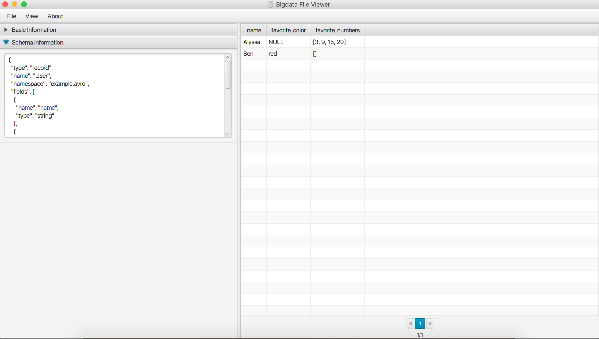
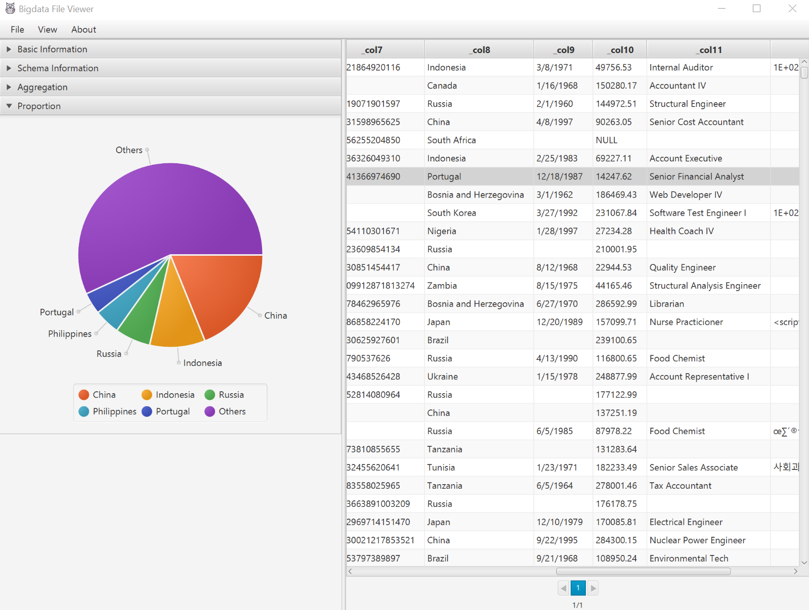

# bigdata-file-viewer
A cross-platform (Windows, MAC, Linux) desktop application to view common bigdata binary format like Parquet, ORC, Avro, etc.
Support local file system, HDFS, AWS S3, etc. Add basic data analysis functions like aggregate operations and checking data proportions.

Note, you're recommended to download release [v1.1.1][4] to if you just want to view **local** bigdata binary files, it's lightweight without dependency to AWS SDK, Azure SDK, etc. Quite honestly, you can download data files from web portal of AWS, Azure ,etc. before viewing it with this tool. The reason why I integrated the cloud storage system's SDK into this tool is more like a demo of **how to use Java to read files from specific storage system**.

## Feature List
 - Open and view Parquet, ORC and Avro at local directory, HDFS, AWS S3, etc.
 - Convert binary format data to text format data like CSV
 - Support complex data type like array, map, struct, etc
 - Suport multiple platforms like Windows, MAC and Linux
 - Data analysis funcions like aggregate operations and checking data proportions
 - Code is extensible to involve other data format
 
## Usage
 - Download runnable jar from [release page][1] or follow `Build` section to build from source code.
 - Invoke it by `java -jar BigdataFileViewer-1.3-SNAPSHOT-jar-with-dependencies.jar` or invoke with parameter '-a' which means enable experimental analytics feature
 - Open binary format file by "File" -> "Open". Currently, it can open file with parquet suffix, orc suffix and avro suffix. If no suffix specified, the tool will try to extract it as Parquet file
 - Set the maximum rows of each page by "View" -> `Input maximum row number` -> "Go"
 - Set visible properties by "View" -> "Add/Remove Properties"
 - Convert to CSV file by "File" -> "Save as" -> "CSV"
 - Check schema information by unfolding "Schema Information" panel
 
 [Click here for live demo][2]
 
 ## Build 
 - Use `mvn package` to build an all-in-one runnable jar. If you're using JDK11 or higher, using `mvn package -Pjava11` to include openJFX as Maven dependency directly. If you're using Mac with M1 chip, please make sure your JDK version is 17+ and please build with `mvn package -Pjava17`
 - Java 1.8 or higher is required
 - If you're using Java 1.8 or lower, make sure the Java has javafx bound. For example, I installed openjdk 1.8 on Ubuntu 18.04 and it has no javafx bound, then I installed it following guide [here][3]. 
 
 ## Screenshots
 
 
 
 
 ## Limitation
 The INT96 data type is deprecated per [parqeut-mr][9], so please expect `java.lang.IllegalArgumentException: INT96 is deprecated.` if you're trying to open a parquet file contains INT96 data type. 
 
 ## Thanks
 Speicial thanks to [Meindert Deen][5], [sedzisz][6], [barabulkit][7], [marcomalva][8] who have contributed to the project.

[1]: https://github.com/Eugene-Mark/bigdata-file-viewer/releases
[2]: https://github.com/Eugene-Mark/bigdata-file-viewer/tree/master/resources/demo.gif
[3]: https://stackoverflow.com/a/56166582/3378204
[4]: https://github.com/Eugene-Mark/bigdata-file-viewer/releases/tag/v1.1.1
[5]: https://github.com/mdeenah
[6]: https://github.com/sedzisz
[7]: https://github.com/barabulkit
[8]: https://github.com/marcomalva
[9]: https://issues.apache.org/jira/browse/PARQUET-1480
